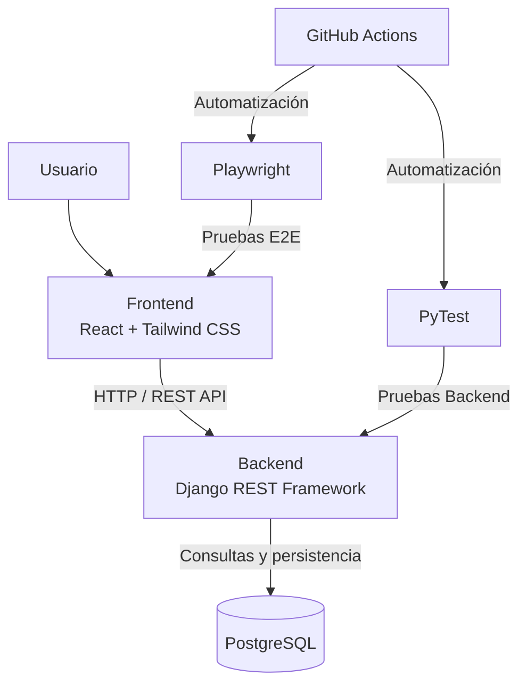

# Proyecto-PruebasdeSoftware

# CrowdStarter

Plataforma web de crowdfunding desarrollada para la asignatura **INF331 — Pruebas de Software** de la Universidad Técnica Federico Santa María.

## Objetivo

Desarrollar una aplicación web de crowdfunding que permita conectar a creadores de proyectos con usuarios interesados en financiarlos mediante aportes.

CrowdStarter permitirá que personas y organizaciones publiquen campañas para presentar sus ideas, establecer una meta de financiamiento y recibir el apoyo de otros usuarios de la plataforma.

Además del desarrollo funcional de la aplicación, el proyecto busca aplicar prácticas de pruebas de software que permitan construir un sistema verificable, trazable y automatizado durante las distintas etapas del semestre.

## Alcance inicial

Para la **Entrega 1** se desarrollará un Producto Mínimo Viable (MVP) que implemente el flujo principal de CrowdStarter.

El alcance inicial contempla:

- Registro e inicio de sesión de usuarios.
- Creación de campañas.
- Listado de campañas.
- Búsqueda de campañas.
- Visualización del detalle de una campaña.
- Edición de campañas.
- Eliminación de campañas.
- Publicación de campañas.
- Registro de aportes.
- Visualización del progreso de financiamiento.
- Persistencia de datos.

## Tecnologías

| Área | Tecnología | Propósito |
|---|---|---|
| Frontend | React | Desarrollo de la interfaz de usuario |
| Estilos | Tailwind CSS | Diseño y estilos de la aplicación |
| Backend | Django REST Framework | Desarrollo de la API REST |
| Base de datos | PostgreSQL | Persistencia de datos |
| Testing Backend | PyTest | Pruebas automatizadas del backend |
| Testing E2E | Playwright | Pruebas automatizadas de los flujos de usuario |
| Automatización | GitHub Actions | Ejecución automatizada de procesos y pruebas |
| Control de versiones | Git / GitHub | Gestión y versionado del código |

## Arquitectura general

La aplicación utilizará una arquitectura cliente-servidor. El frontend desarrollado en React se comunicará mediante HTTP con una API REST desarrollada utilizando Django REST Framework. La información persistente será almacenada en PostgreSQL.

## Integrantes

| Integrante | Rol |
|---|---|
| Benjamín Araos |  |
| Dan Gonzalez |  |
| Jaime Donoso |  |
| Iben Muñoz | 202204674-0 |

> Los roles y responsabilidades internas serán definidos por el equipo y podrán rotar durante el desarrollo del proyecto.

## Estado del desarrollo

### Entrega 1 — En desarrollo

El proyecto se encuentra actualmente en su etapa inicial.

**Estado actual:**

- [x] Selección del tema: CrowdStarter.
- [x] Definición del stack tecnológico.
- [x] Definición inicial del alcance del MVP.
- [x] Definición inicial de la arquitectura.
- [ ] Definición de requisitos e historias de usuario.
- [ ] Configuración del repositorio y flujo Git.
- [ ] Configuración del backend.
- [ ] Configuración de PostgreSQL.
- [ ] Configuración del frontend.
- [ ] Implementación de funcionalidades del MVP.
- [ ] Implementación de pruebas automatizadas.
- [ ] Configuración de GitHub Actions.
- [ ] Documentación de la Entrega 1.
- [ ] Release `v1.0-entrega1`.
