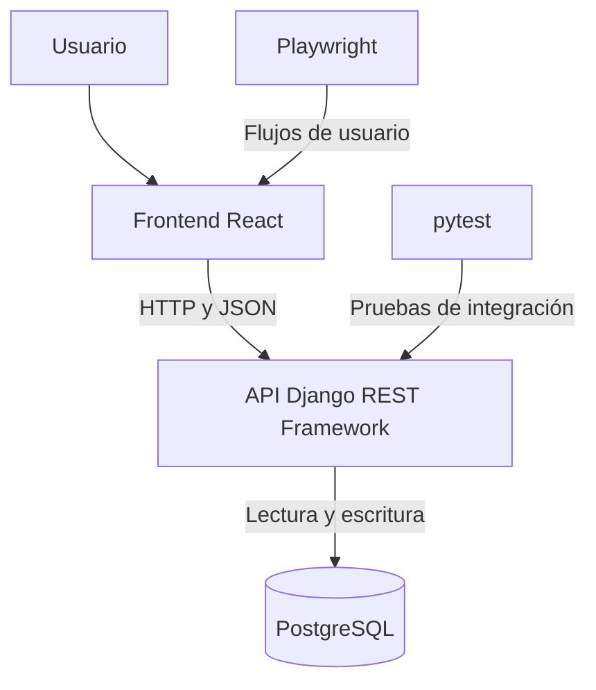

# CrowdStarter

Plataforma web de crowdfunding desarrollada para la asignatura **INF331 — Pruebas de Software** de la Universidad Técnica Federico Santa María.

## Objetivo

Desarrollar una plataforma que permita a los usuarios publicar y descubrir proyectos que buscan financiamiento.

El proyecto también busca aplicar prácticas de pruebas de software para verificar los requisitos, detectar errores y comprobar que las funcionalidades se mantienen después de integrar cambios.

## Alcance de la Entrega 1

La primera entrega implementa la gestión de usuarios y campañas:

- Registro de usuarios con validación de campos, mayoría de edad y duplicados.
- Inicio de sesión mediante correo electrónico y contraseña.
- Autenticación mediante tokens JWT.
- Creación y publicación de campañas.
- Visualización de campañas propias.
- Búsqueda por nombre, sin distinguir mayúsculas ni tildes.
- Consulta del detalle de una campaña.
- Edición y eliminación de campañas por su propietario.
- Confirmación antes de eliminar.
- Visualización de la meta y del progreso de financiamiento almacenado.
- Persistencia de datos en PostgreSQL.
- Interfaz adaptable a distintos tamaños de pantalla.

**Fuera del alcance actual:** procesamiento de pagos y registro de aportes monetarios reales. La visualización del progreso no implica que exista un flujo de donaciones implementado.

La búsqueda utiliza coincidencias de texto en el título; no implementa un motor de búsqueda semántica.

## Funcionalidades implementadas

| Funcionalidad | Descripción |
|---|---|
| Registro | Creación de cuentas con nombre de usuario, correo, contraseña y fecha de nacimiento |
| Inicio de sesión | Autenticación mediante correo y contraseña |
| Crear campaña | Publicación de una campaña con sus datos obligatorios e imagen opcional |
| Mis campañas | Listado de las campañas pertenecientes al usuario autenticado |
| Buscar campañas | Búsqueda por el nombre de una campaña |
| Ver detalle | Consulta de descripción, categoría, creador, meta, progreso y fecha límite |
| Editar campaña | Modificación de una campaña por su propietario |
| Eliminar campaña | Eliminación por su propietario, previa confirmación |

### CRUD de campañas

| Operación | Implementación |
|---|---|
| Create | Crear y publicar campañas |
| Read | Listar, buscar y consultar campañas |
| Update | Editar campañas propias |
| Delete | Eliminar campañas propias |

### Validaciones principales

- Campos obligatorios y formato del correo.
- Edad mínima de 18 años para registrarse.
- Rechazo de nombres de usuario y correos duplicados.
- Mensaje genérico ante credenciales incorrectas.
- Meta de financiamiento mayor que cero.
- Fecha límite igual o posterior al día actual.
- Verificación de propiedad para editar y eliminar campañas.

## Tecnologías

| Área | Tecnología | Propósito |
|---|---|---|
| Frontend | React + Vite | Interfaz y entorno de desarrollo |
| Navegación | React Router | Navegación entre vistas |
| Estilos | CSS y Tailwind CSS | Presentación visual |
| Backend | Django REST Framework | API REST y validación de datos |
| Base de datos | PostgreSQL | Persistencia |
| Autenticación | Simple JWT | Emisión y validación de tokens |
| Imágenes | Pillow | Soporte de imágenes en Django |
| Pruebas del backend | pytest + pytest-django | Pruebas de integración |
| Pruebas unitarias | Node.js Test Runner | Verificación aislada de la búsqueda |
| Pruebas E2E | Playwright | Verificación de flujos desde el navegador |
| Control de versiones | Git / GitHub | Ramas, revisión e integración de cambios |

La automatización de pruebas mediante GitHub Actions se contempla como mejora del proceso. La ejecución local se describe más adelante.

## Arquitectura general

React se comunica mediante HTTP con la API de Django REST Framework. El backend procesa las solicitudes, valida los datos y utiliza PostgreSQL para almacenarlos.



### Organización del proyecto

```text
api/
    models.py                 Modelos de datos
    serializers.py            Serialización y validaciones
    views.py                  Vistas de la API y permisos
    migrations/               Migraciones de la base de datos
    test_registro.py           Pruebas de registro
    test_login.py              Pruebas de autenticación
    test_campanias.py          Pruebas de campañas

config/
    settings.py               Configuración de Django
    urls.py                   Rutas de la API

frontend/
    src/                      Componentes, páginas y estilos
    tests/                    Pruebas de Playwright
    unit/                     Pruebas unitarias de búsqueda
    package.json              Dependencias y scripts
    package-lock.json         Versiones resueltas del frontend
    playwright.config.js      Configuración de pruebas E2E

docs/                         Documentación de funcionalidades y usabilidad
manage.py                     Administración de Django
requirements.txt              Dependencias de Python
```

## Instalación y ejecución local

### Requisitos previos

- Git.
- Python compatible con las dependencias de `requirements.txt`.
- Node.js y npm. En el desarrollo se utilizó Node.js 24.
- PostgreSQL instalado y en ejecución.

Cada computador necesita su propio entorno virtual y su configuración de PostgreSQL. Clonar el repositorio no transfiere bases de datos, cuentas, campañas ni imágenes cargadas en otro equipo.

### 1. Obtener el código

```bash
git clone https://github.com/IbenMG/Proyecto-PruebasdeSoftware.git
cd Proyecto-PruebasdeSoftware
git switch develop
```

Si el repositorio ya está clonado, comprobar primero que no existan cambios pendientes:

```bash
git status
git fetch origin
git switch develop
git pull --ff-only origin develop
```

### 2. Preparar PostgreSQL

Crear una base de datos llamada `crowdstarter` y asignarla al usuario que utilizará Django.

Desde una sesión administrativa de PostgreSQL, si el usuario ya existe:

```sql
CREATE DATABASE crowdstarter OWNER masteruser;
```

Si el usuario no existe, crearlo antes:

```sql
CREATE ROLE masteruser WITH LOGIN PASSWORD 'REEMPLAZAR_POR_CLAVE_LOCAL';
CREATE DATABASE crowdstarter OWNER masteruser;
```

Estos comandos se ejecutan una sola vez. Si la base y el usuario ya existen, no es necesario recrearlos.

Revisar el bloque `DATABASES` en `config/settings.py` y comprobar que el usuario, contraseña, host y puerto coincidan con la instalación local.

El nombre de la base se puede seleccionar mediante la variable de entorno `DB_NAME`. Las demás credenciales deben coincidir con la configuración del archivo.

> Las migraciones crean las tablas dentro de una base existente; no crean la base de datos PostgreSQL.

### 3. Backend en Windows

Desde la raíz del proyecto, en PowerShell:

```powershell
python -m venv .venv
.\.venv\Scripts\python.exe -m pip install -r requirements.txt

$env:DB_NAME = "crowdstarter"

.\.venv\Scripts\python.exe manage.py migrate
.\.venv\Scripts\python.exe manage.py runserver
```

No es necesario activar el entorno al utilizar directamente su ejecutable de Python.

### 4. Backend en Linux

Desde la raíz del proyecto:

```bash
python3 -m venv .venv
source .venv/bin/activate
python -m pip install -r requirements.txt

export DB_NAME=crowdstarter

python manage.py migrate
python manage.py runserver
```

En algunas distribuciones puede ser necesario instalar el paquete del sistema que proporciona `venv`.

La variable `DB_NAME` debe establecerse nuevamente al abrir otra terminal.

### 5. Frontend

Abrir otra terminal y entrar a `frontend`.

**Windows:**

```powershell
cd frontend
npm.cmd ci
npm.cmd run dev
```

**Linux:**

```bash
cd frontend
npm ci
npm run dev
```

Acceder a:

- Aplicación: http://localhost:5173
- Backend: http://127.0.0.1:8000

Mantener ambas terminales abiertas. Para detener los servidores, utilizar `Ctrl+C`.

En los siguientes arranques no es necesario reinstalar las dependencias, salvo que estas hayan cambiado.

## Estrategia de pruebas

Las pruebas se organizan a partir de las historias de usuario y sus criterios de aceptación.

| Nivel | Herramienta | Alcance |
|---|---|---|
| Unitarias | Node.js Test Runner | Función de búsqueda aislada |
| Integración | pytest + pytest-django | API, validaciones, permisos y persistencia |
| Extremo a extremo | Playwright | Flujos completos desde el navegador |

### Técnicas utilizadas

- **Particiones de equivalencia:** entradas válidas e inválidas, como correos correctos e incorrectos.
- **Valores límite:** mayoría de edad, meta monetaria y fecha límite.
- **Pruebas de permisos:** operaciones del propietario y rechazo de operaciones de otros usuarios.
- **Regresión:** repetición de pruebas después de integrar funcionalidades o modificar la interfaz.

Usar pytest no convierte automáticamente una prueba en unitaria. Las pruebas de la API se clasifican como integración porque involucran distintos componentes y una base de datos de pruebas.

### Pruebas unitarias de búsqueda

Se implementaron cuatro casos:

1. Coincidencia exacta antes de coincidencias parciales, contemplando mayúsculas y tildes.
2. Consulta vacía.
3. Consulta sin coincidencias.
4. Búsqueda limitada al título.

Desde `frontend`, en Windows o Linux:

```bash
node --test unit/buscarCampanias.test.js
```

No requieren backend, navegador ni base de datos.

### Pruebas de integración del backend

PostgreSQL debe estar funcionando. El usuario utilizado para las pruebas locales necesita permiso para crear la base de datos de pruebas.

Si falta ese permiso, un administrador de PostgreSQL puede otorgarlo al usuario local correspondiente:

```sql
ALTER ROLE masteruser CREATEDB;
```

**Windows, desde la raíz:**

```powershell
$env:DB_NAME = "crowdstarter"
.\.venv\Scripts\python.exe -m pytest api --ds=config.settings -v
```

**Linux, desde la raíz:**

```bash
source .venv/bin/activate
export DB_NAME=crowdstarter
python -m pytest api --ds=config.settings -v
```

Estas pruebas no necesitan `runserver`. pytest-django prepara una base de datos de pruebas separada.

El total actualizado de casos se muestra en la salida de pytest.

### Pruebas E2E

La suite funcional incluye 16 pruebas:

| Área | Cantidad |
|---|---:|
| Registro | 4 |
| Login | 3 |
| Campañas | 3 |
| Eliminación | 3 |
| Búsqueda | 3 |
| **Total** | **16** |

Para ejecutarlas:

1. Iniciar PostgreSQL.
2. Levantar Django en el puerto 8000.
3. Levantar Vite en el puerto 5173.
4. Ejecutar Playwright desde `frontend`.

#### Windows — Brave

Brave debe estar instalado en la ruta indicada en `playwright.config.js`.

```powershell
npx.cmd playwright test tests/registro.spec.js tests/login.spec.js tests/campanias.spec.js tests/busqueda.spec.js tests/eliminar.spec.js --project=brave --headed --workers=1 --reporter=list,html
```

Para abrir el reporte:

```powershell
npx.cmd playwright show-report
```

#### Linux — Chromium

El proyecto `brave` contiene una ruta de Windows. Para Linux se puede utilizar el proyecto `chromium`.

Instalar el navegador y sus dependencias:

```bash
npx playwright install --with-deps chromium
```

Ejecutar la suite:

```bash
npx playwright test tests/registro.spec.js tests/login.spec.js tests/campanias.spec.js tests/busqueda.spec.js tests/eliminar.spec.js --project=chromium --headed --workers=1 --reporter=list,html
```

Para abrir el reporte:

```bash
npx playwright show-report
```

La opción `--headed` muestra el navegador y requiere un entorno gráfico.

> Las pruebas E2E crean usuarios y campañas en el backend al que apuntan. Ejecutarlas en un entorno de desarrollo destinado a pruebas.

### Compilación del frontend

Desde `frontend`:

**Windows:**

```powershell
npm.cmd run build
```

**Linux:**

```bash
npm run build
```

## Integrantes

| Integrante | Rol académico | Responsabilidad principal |
|---|---|---|
| Benjamín Araos | 202273637-2  | Testing |
| Dan Gonzalez | 202273543-0 | Backend |
| Jaime Donoso | 202273645-3 | Frontend |
| Iben Muñoz | 202204674-0 | Full-stack |

Las responsabilidades principales no excluyen la colaboración en otras áreas del proyecto.

## Flujo de trabajo

- `main`: versiones estables destinadas a entrega.
- `develop`: integración del desarrollo.
- `feature/*`: funcionalidades y mejoras.
- Pull Requests para revisar e integrar los cambios.

Antes de integrar cambios, ejecutar las pruebas relacionadas y comprobar que las funcionalidades existentes continúen operativas.

## Documentación

- [Repositorio](https://github.com/IbenMG/Proyecto-PruebasdeSoftware)
- [Wiki](https://github.com/IbenMG/Proyecto-PruebasdeSoftware/wiki)
- [Releases](https://github.com/IbenMG/Proyecto-PruebasdeSoftware/releases)
- [Documentación del proyecto](docs/)
- [Decisiones de usabilidad](docs/usabilidad-interfaz.md)

**Video de la Entrega 1:** 
[video](https://usmcl-my.sharepoint.com/:v:/g/personal/iben_munoz_usm_cl/IQB4rWI5bBhDS6ayKutz5tzoAXQ0Ta8v61SwzMZj1dAdJJo?nav=eyJyZWZlcnJhbEluZm8iOnsicmVmZXJyYWxBcHAiOiJPbmVEcml2ZUZvckJ1c2luZXNzIiwicmVmZXJyYWxBcHBQbGF0Zm9ybSI6IldlYiIsInJlZmVycmFsTW9kZSI6InZpZXciLCJyZWZlcnJhbFZpZXciOiJNeUZpbGVzTGlua0NvcHkifX0&e=TPSdtb).

## Estado del desarrollo

### Entrega 1

- [x] Selección del tema y tecnologías.
- [x] Definición de requisitos e historias de usuario.
- [x] Configuración del repositorio y trabajo mediante ramas.
- [x] Configuración del backend, frontend y PostgreSQL.
- [x] Registro y autenticación.
- [x] CRUD de campañas.
- [x] Búsqueda y visualización de campañas propias.
- [x] Validaciones y permisos.
- [x] Pruebas unitarias, de integración y E2E.
- [x] Mejora visual de la interfaz.
- [x] Incorporar el enlace al video.
- [ ] Confirmar la publicación de la release `v1.0-entrega1`.
